# Create and view decomposition tree visuals in Power BI

[!INCLUDE[consumer-appliesto-nyyn](../includes/consumer-appliesto-nyyn.md)]

[!INCLUDE [power-bi-visuals-desktop-banner](../includes/power-bi-visuals-desktop-banner.md)]

The decomposition tree visual in Power BI lets you visualize data across multiple dimensions. It automatically aggregates data and enables drilling down into your dimensions in any order. It is also an artificial intelligence (AI) visualization, so you can ask it to find the next dimension to drill down into based on certain criteria. This makes it a valuable tool for ad hoc exploration and conducting root cause analysis.

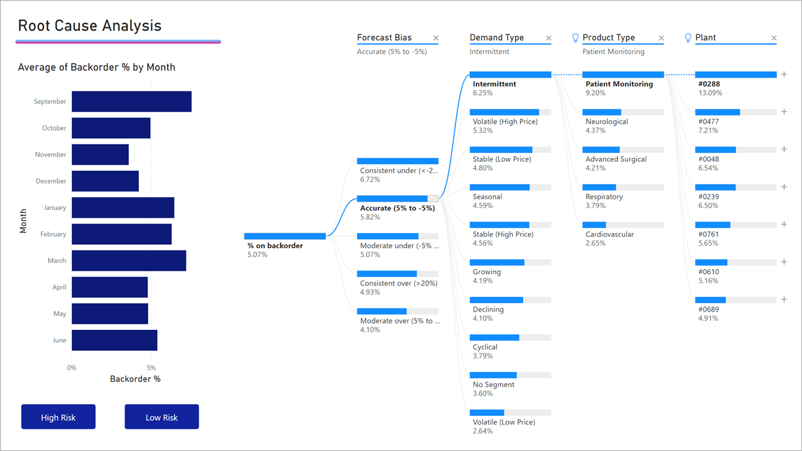

This tutorial uses two examples:

- A supply chain scenario that analyzes the percentage of products a company has on backorder (out of stock).  
- A sales scenario that breaks down video game sales by numerous factors like game genre and publisher.

You can find the pbix used in the supply chain scenario here: [Supply Chain Sample.pbix](
https://github.com/microsoft/powerbi-desktop-samples/blob/master/Sample%20Reports/Supply%20Chain%20Sample.pbix).

> [!NOTE]
> Sharing your report with a Power BI colleague requires that you both have individual Power BI Pro licenses or that the report is saved in Premium capacity.    

## Get started
Select the decomposition tree icon from the Visualizations pane.
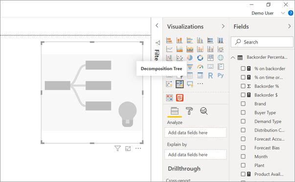

The visualization requires two types of input:

 - **Analyze** – the metric you would like to analyze. This has to be a measure or an aggregate.  
 - **Explain By** – one or more dimensions you would like to drill down into.

Once you drag your measure into the field well, the visual updates showcasing the aggregated measure. In the example below, we are visualizing the average % of products on backorder (5.07%).

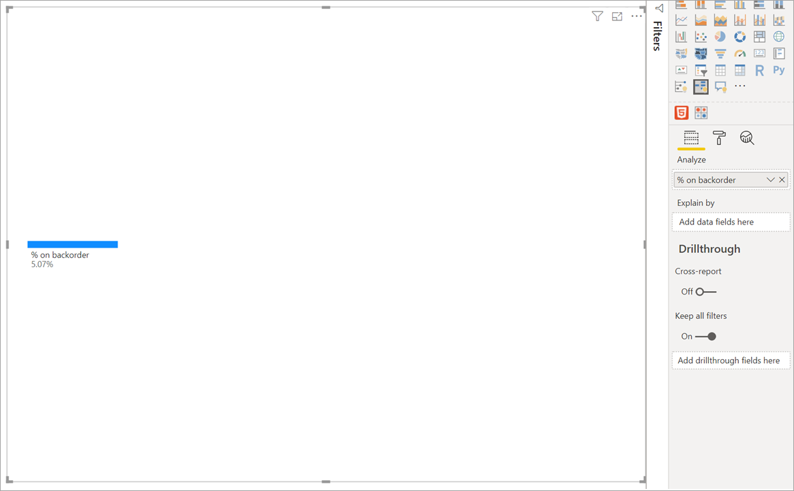

The next step is to bring in one or more dimensions you would like to drill down into. Add these fields to the **Explain by** bucket. Notice that a plus sign appears next to your root node. Selecting the + lets you choose which field you would like to drill into (you can drill into fields in any order that you want).

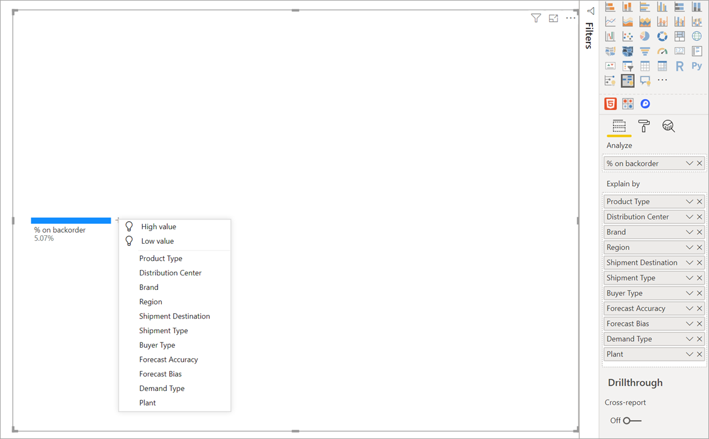

Selecting **Forecast bias** results in the tree expanding and breaking down the measure by the values in the column. This process can be repeated by choosing another node to drill into.

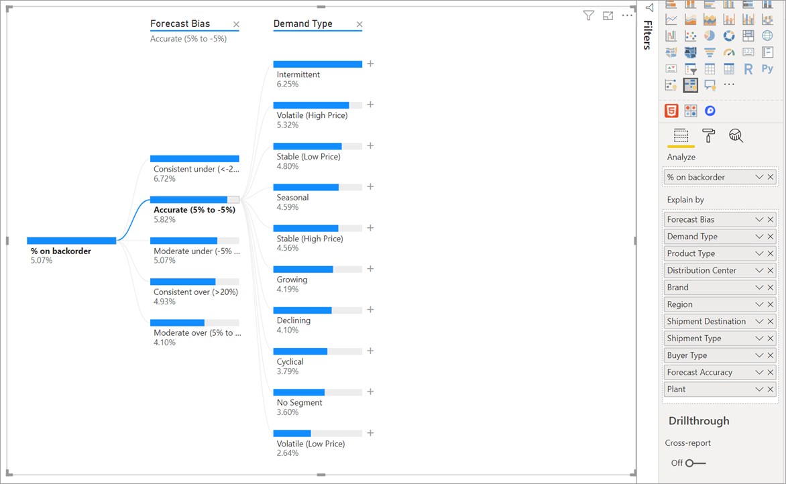

Selecting a node from the last level cross-filters the data. Selecting a node from an earlier level changes the path.

Interacting with other visuals cross-filters the decomposition tree. The order of the nodes within levels could change as a result.
In the example below, we've cross-filtered the tree by Ubisoft. The path updates and Xbox sales move from first to second place, surpassed by PlayStation. 

If we then cross-filter the tree by Nintendo, Xbox sales are blank as there are no Nintendo games developed for Xbox. Xbox, along with its subsequent path, gets filtered out of the view.

Despite the path disappearing, the existing levels (in this case Game Genre) remain pinned on the tree. Selecting the Nintendo node therefore automatically expands the tree to Game Genre.

## AI splits

You can use “AI Splits” to figure out where you should look next in the data. These splits appear at the top of the list and are marked with a lightbulb. The splits are there to help you find high and low values in the data, automatically.

The analysis can work in two ways depending on your preferences. The default behavior is as follows:

 - **High Value**: Considers all available fields and determines which one to drill into to get the highest value of the measure being analyzed.  
 - **Low Value**: Considers all available fields and determines which one to drill into to get the lowest value of the measure being analyzed.  

Selecting **High Value** in the backorders example, results in the following:

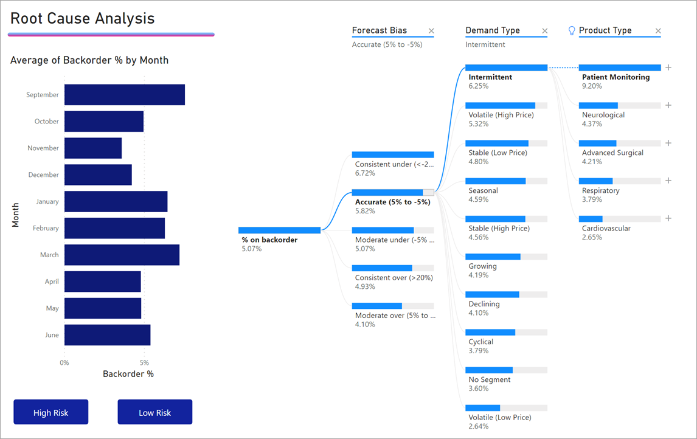

A lightbulb appears next to **Product Type** indicating this was an ‘AI split’. The tree also provides a dotted line recommending the **Patient Monitoring** node as that results in the highest value of backorders (9.2%). 

Hover over the lightbulb to see a tooltip. In this example, the tooltip is “% on backorder is highest when Product Type is Patient Monitoring”.

You can configure the visual to find **Relative** AI splits as opposed to **Absolute** ones. 

Relative mode looks for high values that stand out (compared to the rest of the data in the column). To illustrate this, let’s take a look at an example:

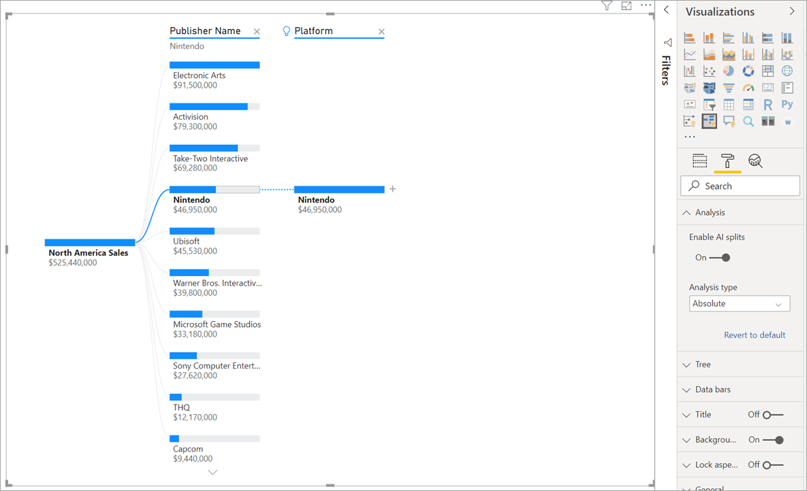

In the screenshot above, we are looking at North America sales of video games. We first split the tree by **Publisher Name** and then drill into Nintendo. Selecting **High Value** results in the expansion of **Platform is Nintendo**. Since Nintendo (the publisher) only develops for Nintendo consoles, there is only one value present and so that is unsurprisingly the highest value.

Nevertheless, a more interesting split would be to look at which high value stands out relative to other values in the same column. If we change the Analysis type from **Absolute** to **Relative**, we get the following result for Nintendo:
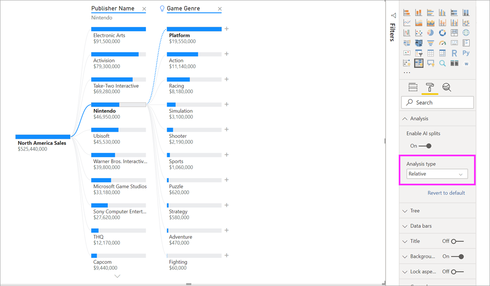

This time, the recommended value is **Platform within Game Genre**.  Platform doesn’t yield a higher absolute value than Nintendo ($19,950,000 vs. $46,950,000). Nevertheless it’s a value that stands out.

More precisely, since there are 10 Game Genre values, the expected value for Platform would be $4.6M if they were to be split evenly. Since Platform has a value of almost $20M, that is an interesting result as it is four times higher than the expected result.

The calculation is as follows:

North America Sales for Platform/ Abs(Avg(North America Sales for Game Genre))  
vs.  
North America Sales for Nintendo / Abs(Avg(North America Sales for Platform))  

Which translates to:

19,550,000 / (19,550,000 + 11,140,000 + ... + 470,000 + 60,000 /10) = 4.25x  
vs.  
46,950,000/ (46,950,000/1) = 1x  

If you prefer not to use any AI splits in the tree, you also have the option of turning them off under the **Analysis formatting** options:  

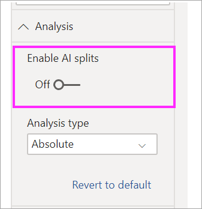

## Tree interactions with AI splits

You can have multiple subsequent AI levels. You can also mix up different kinds of AI levels (go from High Value to Low Value and back to High Value):

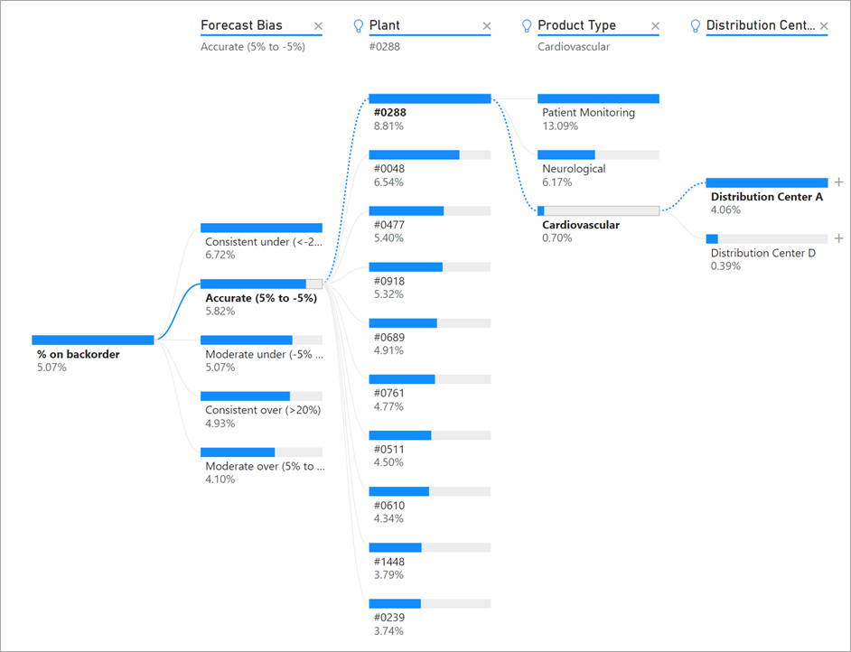

If you select a different node in the tree, the AI Splits recalculate from scratch. In the example below, we changed the selected node in the **Forecast Bias** level. The subsequent levels change to yield the correct High and Low Values.

AI levels are also recalculated when you cross-filter the decomposition tree by another visual. In the example below, we can see that our backorder % is highest for Plant #0477.

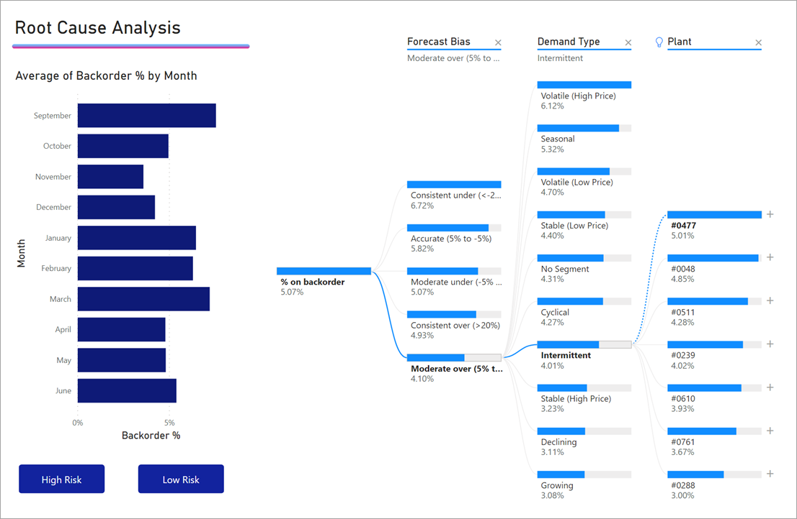

But if we select **April** in the bar chart, the highest changes to **Product Type is Advanced Surgical**. In this case, it’s not just the nodes that got reordered, but a completely different column was chosen. 

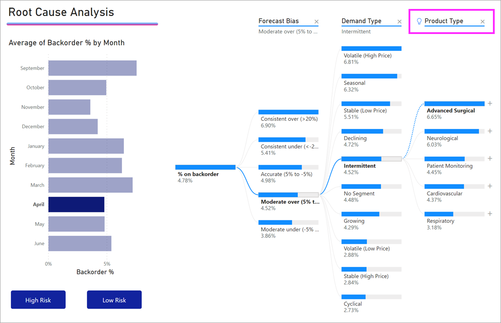

If we want AI levels to behave like non-AI levels, select the lightbulb to revert the behavior to default. 

While multiple AI levels can be chained together, a non-AI level cannot follow an AI level. If we do a manual split following an AI split, the lightbulb from the AI level disappears and the level transforms into a normal level. 

## Locking

A content creator can lock levels for report consumers. When a level is locked, it cannot be removed or changed. A consumer can explore different paths within the locked level but they cannot change the level itself. As a creator you can hover over existing levels to see the lock icon. You can lock as many levels as you want, but you cannot have unlocked levels preceding locked levels.

In the example below, the first two levels are locked. This means that report consumers can change level 3 and 4, and even add new levels afterwards. The first two levels however cannot be changed:

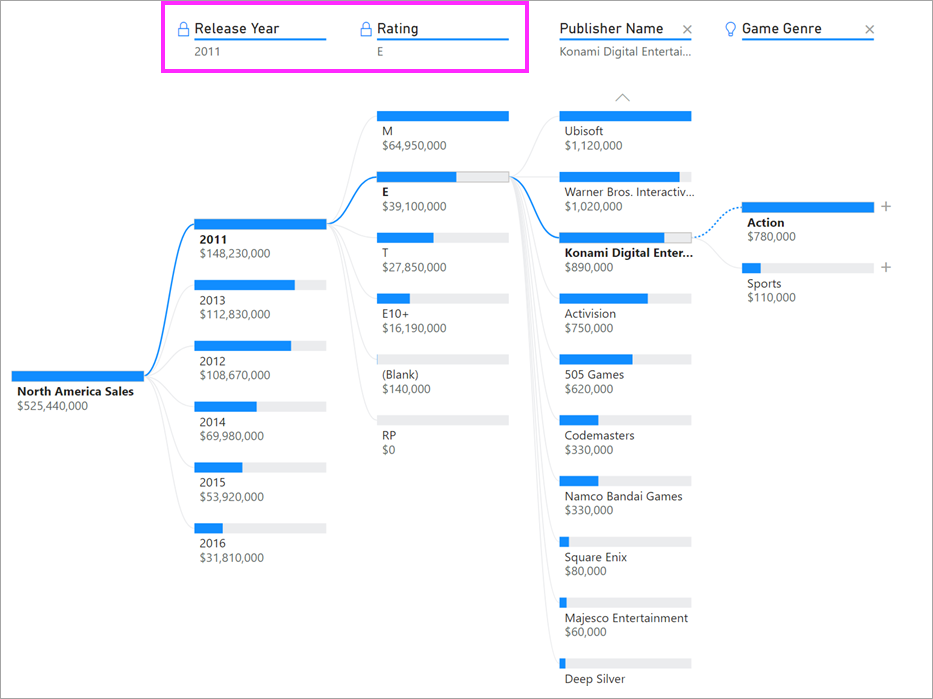

## Known limitations

The maximum number of levels for the tree is 50. Maximum number of data points that can be visualized at one time on the tree is 5000. We truncate levels to show top n. Currently the top n per level is set to 10. 

The decomposition tree is not supported in the following scenarios:  
-	On-premises Analysis Services

AI splits are not supported in the following scenarios:  
-	Azure Analysis Services
-	Power BI Report Server
-	Publish to Web
-	Complex measures and measures from extensions schemas in 'Analyze'

Other limitations:
- Support inside Q&A

## Next steps

[Power BI doughnut chart](power-bi-visualization-doughnut-charts.md)

[Power BI visualizations](power-bi-report-visualizations.md)

