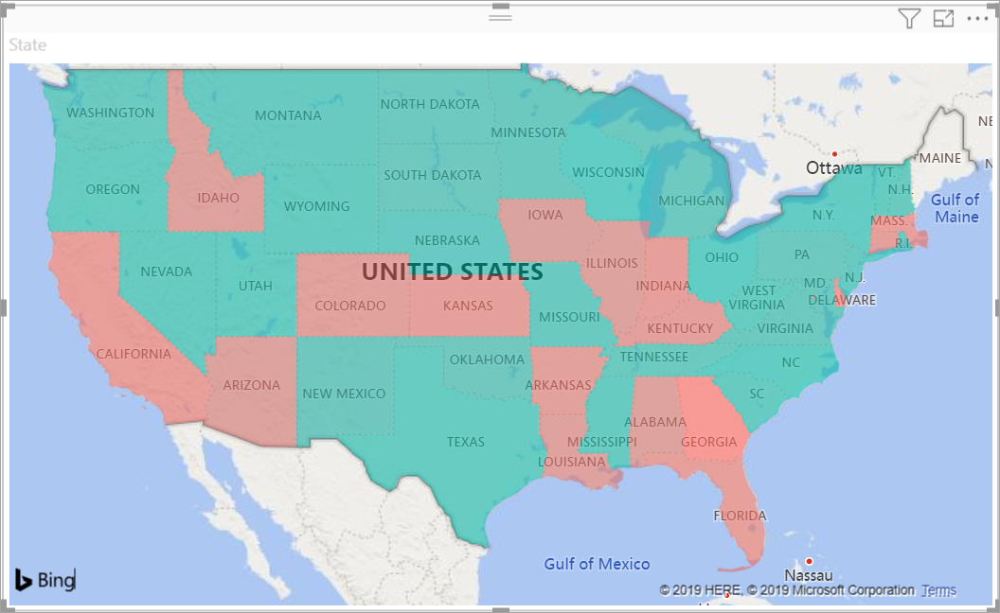
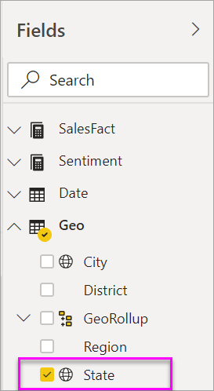
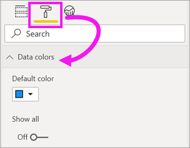
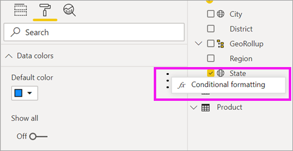
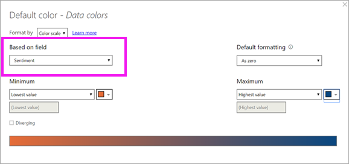
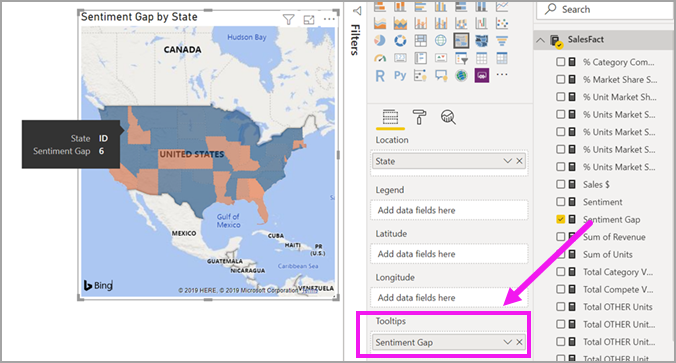
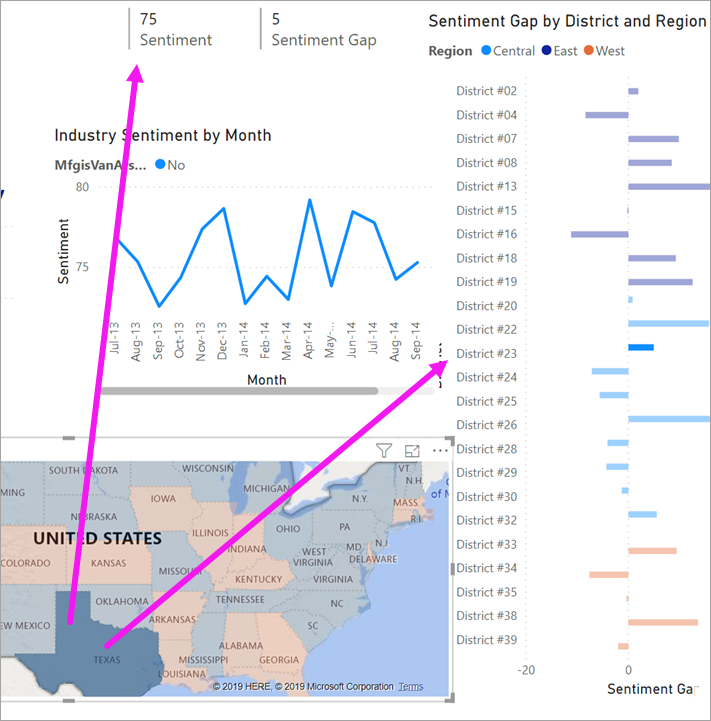
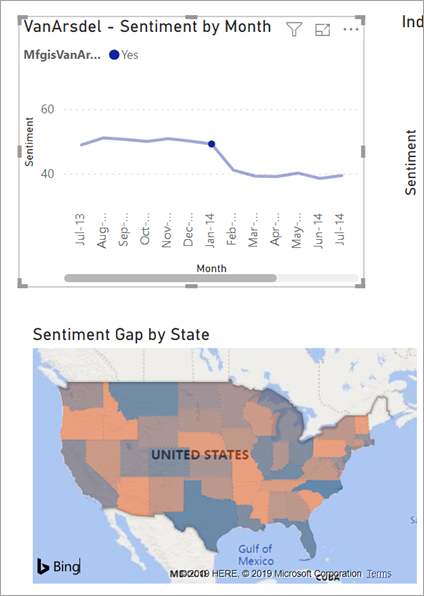
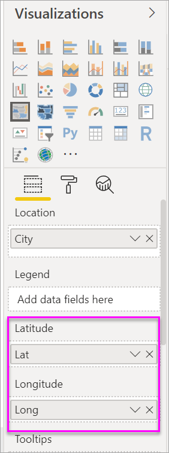

# Create and use filled maps (choropleth maps) in Power BI

[!INCLUDE[consumer-appliesto-nyyn](../includes/consumer-appliesto-nyyn.md)]

[!INCLUDE [power-bi-visuals-desktop-banner](../includes/power-bi-visuals-desktop-banner.md)]

A filled map uses shading or tinting or patterns to display how a value differs in proportion across a geography or region.  Quickly display these relative differences with shading that ranges from light (less-frequent/lower) to dark (more-frequent/more).    

## What is sent to Bing
Power BI integrates with Bing to provide default map coordinates (a process called geo-coding). When you create a map visualization in Power BI service or Power BI Desktop, the data in the **Location**, **Latitude**, and **Longitude** buckets (that is being used to create that visualization) is sent to Bing.

You, or your administrator, may need to update your firewall to allow access to the URLs Bing uses for geocoding.  Those URLs are:
- https://dev.virtualearth.net/REST/V1/Locations    
- https://platform.bing.com/geo/spatial/v1/public/Geodata    
- https://www.bing.com/api/maps/mapcontrol

For more information about the data being sent to Bing, and for tips to increase your geo-coding success, see [Tips and tricks for map visualizations](power-bi-map-tips-and-tricks.md).

## When to use a filled map
Filled maps are a great choice:

* to display quantitative information on a map.
* to show spatial patterns and relationships.
* when your data is standardized.
* when working with socioeconomic data.
* when defined regions are important.
* to get an overview of the distribution across the geographic locations.

### Prerequisites
This tutorial uses the [Sales and Marketing sample PBIX file](https://download.microsoft.com/download/9/7/6/9767913A-29DB-40CF-8944-9AC2BC940C53/Sales%20and%20Marketing%20Sample%20PBIX.pbix).
1. From the upper left section of the menu bar, select **File** > **Open**
   
2. Find your copy of the **Sales and Marketing sample PBIX file**

1. Open the **Sales and Marketing sample PBIX file** in report view .

1. Select  to add a new page.

> [!NOTE]
> Sharing your report with a Power BI colleague requires that you both have individual Power BI Pro licenses or that the report is saved in Premium capacity.    

### Create a filled map
1. From the Fields pane, select the **Geo** \> **State** field.    

   
2. [Convert the chart](power-bi-report-change-visualization-type.md) to a filled map. Notice that **State** is now in the **Location** well. Bing Maps uses the field in the **Location** well to create the map.  The location can be a variety of valid locations: countries, states, counties, cities, zip codes, or other postal codes etc. Bing Maps provides filled map shapes for locations around the world. Without a valid entry in the Location well, Power BI cannot create the filled map.  

   
3. Filter the map to display only the continental United States.

   a.  To the left of the Visualizations pane, look for the **Filters** pane. Expand it if it is minimized

   b.  Hover over **State** and select the expand chevron  
   

   c.  Place a check mark next to **All** and remove the check mark next to **AK**.

   
4. Select the paint roller icon to open the Formatting pane, and choose **Data colors**.

    

5. Select the three vertical dots and choose **Conditional formatting**.

    

6. Use the **Default color - Data colors** screen to determine how your filled map will be shaded. The options available to you include which field to base the shading, and how to apply the shading. In this example we're using the field **SalesFact** > **Sentiment**, and setting the lowest value for sentiment as orange and the highest value as blue. Values that fall between the maximum and minimum will be shades of orange and blue. The illustration at the bottom of the screen shows the range of colors that will be used. 

    

7. The filled map is shaded in green and red, with red representing the lower sentiment numbers and green representing the higher, more-positive sentiment.  To display additional detail, drag a field into the Tooltips well.  Here we've added **SalesFact** > **Sentiment gap**. Highlighting the state of Idaho (ID) shows us that sentiment gap is low, at 6.
   

10. [Save the report](../service-report-save.md).

Power BI gives you plenty of control over the appearance of your filled map. Play around with these data color controls until you get the look you want. 

## Highlighting and cross-filtering
For information about using the Filters pane, see [Add a filter to a report](../power-bi-report-add-filter.md).

Highlighting a location in a filled map cross-filters the other visualizations on the report page... and vice versa.

1. To follow along, first save this report by selecting **File > Save**. 

2. Copy the filled map using CTRL-C.

3. From the bottom of the report canvas, select the **Sentiment** tab to open the Sentiment report page.

    

4. Move and resize the visualizations on the page to make some room, then CTRL-V paste the filled map from the previous report. (See the following images)

   

5. On the filled map, select a state.  This cross-highlights and cross-filters the other visualizations on the page. Selecting **Texas**, for example, cross-filters the cards and cross-highlights the bar chart. From this, I know that Sentiment is 75 and that Texas is in the Central District #23.   
   
2. Select a data point on the VanArsdel - Sentiment by Month line chart. This filters the filled map to show Sentiment data for VanArsdel and not their competition.  
   

## Considerations and troubleshooting
Map data can be ambiguous.  For example, there's a Paris, France, but there's also a Paris, Texas. Your geographic data is probably stored in separate columns – a column for city names, a column for state or province names, etc. – so Bing may not be able to tell which Paris is which. If your dataset already contains latitude and longitude data, Power BI has special fields to help make the map data unambiguous. Just drag the field that contains your latitude data into the Visualizations \> Latitude area.  And do the same for your longitude data.    

If you have permissions to edit the dataset in Power BI Desktop, watch this video for help with addressing map ambiguity.

> [VIDEO https://www.youtube.com/embed/Co2z9b-s_yM]

If you do not have access to latitude and longitude data, but you do have edit access to the dataset, [follow these instructions to update your dataset](https://support.office.com/article/Maps-in-Power-View-8A9B2AF3-A055-4131-A327-85CC835271F7).

For more help with Map visualizations, see [Tips and tricks for map visualizations](../power-bi-map-tips-and-tricks.md).

## Next steps

[Shape map](desktop-shape-map.md)

[Visualization types in Power BI](power-bi-visualization-types-for-reports-and-q-and-a.md)
