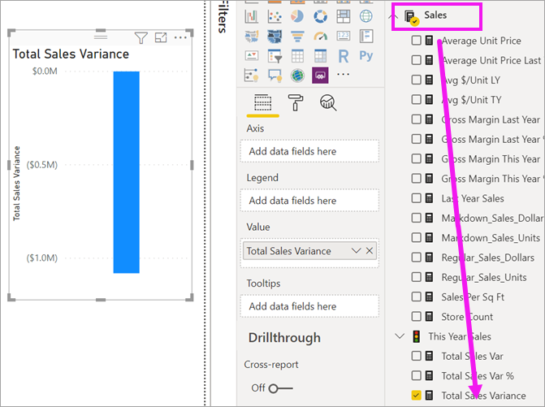
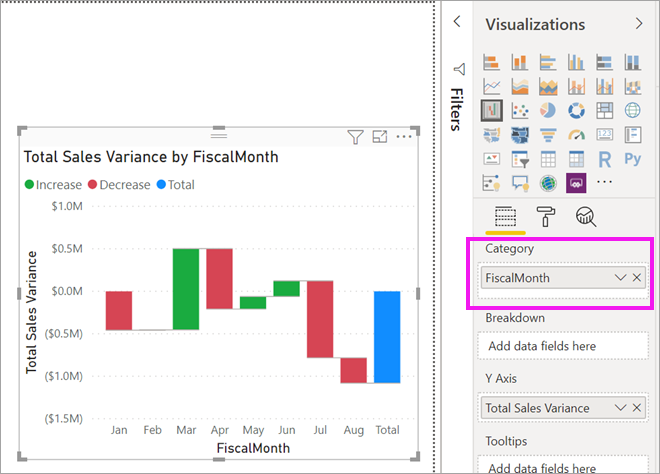
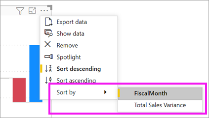
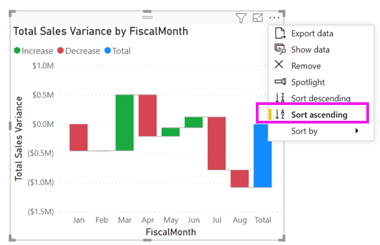
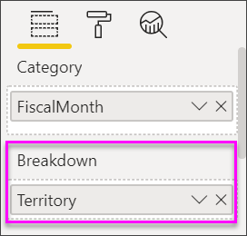
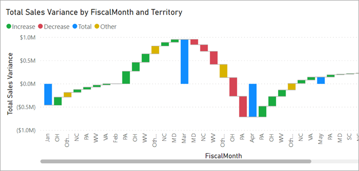
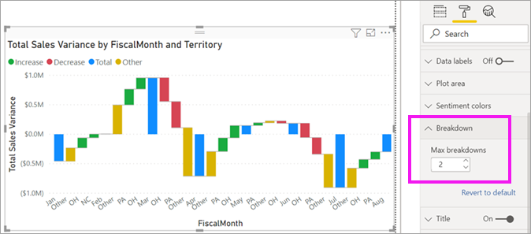
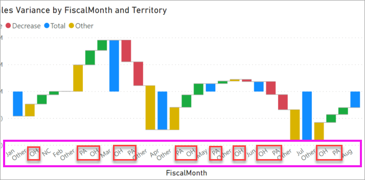

# Waterfall charts in Power BI

[!INCLUDE[consumer-appliesto-nyyn](../includes/consumer-appliesto-nyyn.md)]

[!INCLUDE [power-bi-visuals-desktop-banner](../includes/power-bi-visuals-desktop-banner.md)]

Waterfall charts show a running total as Power BI adds and subtracts values. They're useful for understanding how an initial value (like net income) is affected by a series of positive and negative changes.

The columns are color coded so you can quickly notice increases and decreases. The initial and the final value columns often [start on the horizontal axis](https://support.office.com/article/Create-a-waterfall-chart-in-Office-2016-for-Windows-8de1ece4-ff21-4d37-acd7-546f5527f185#BKMK_Float "start on the horizontal axis"), while the intermediate values are floating columns. Because of this style, waterfall charts are also called bridge charts.

## When to use a waterfall chart

Waterfall charts are a great choice:

* When you have changes for the measure across time, a series, or different categories.

* To audit the major changes contributing to the total value.

* To plot your company's annual profit by showing various sources of revenue and arrive at the total profit (or loss).

* To illustrate the beginning and the ending headcount for your company in a year.

* To visualize how much money you make and spend each month, and the running balance for your account.

## Prerequisite

This tutorial uses the [Retail Analysis sample PBIX file](https://download.microsoft.com/download/9/6/D/96DDC2FF-2568-491D-AAFA-AFDD6F763AE3/Retail%20Analysis%20Sample%20PBIX.pbix).

1. From the upper left section of the menubar, select **File** > **Open**
   
2. Find your copy of the **Retail Analysis sample PBIX file**

1. Open the **Retail Analysis sample PBIX file** in report view .

1. Select  to add a new page.

> [!NOTE]
> Sharing your report with a Power BI colleague requires that you both have individual Power BI Pro licenses or that the report is saved in Premium capacity.    

## Create a waterfall chart

You'll create a waterfall chart that displays sales variance (estimated sales versus actual sales) by month.

### Build the waterfall chart

1. From the **Fields** pane, select **Sales** > **Total Sales Variance**.

   

1. Select the waterfall icon 

    

1. Select **Time** > **FiscalMonth** to add it to the **Category** well.

    

### Sort the waterfall chart

1. Make sure Power BI sorts the waterfall chart chronologically by month. From the top-right corner of the chart, select **More options** (...).

    For this example, select **Sort by** and choose **FiscalMonth**. A yellow indicator next to your selection indicates when your selection option is being applied.

    
    
    To display the months in chronological order, select **Sort ascending**. As with the previous step, check that there is a yellow indicator next to the left of **Sort ascending.** This indicates that your selected option is being applied.

    

    

    Notice that your chart is sorted from January to August for FiscalMonth.  

### Explore the waterfall chart

Dig in a little more to see what's contributing most to the changes month to month.

1.  Select **Store** > **Territory**, which will add **Territory** to the **Breakdown** bucket.

    

    Power BI uses the value in **Breakdown** to add additional data to the visualization. It adds the top five contributors to increases or decreases for each fiscal month. This means that February, for example, now has six data points instead of just one.  

    

    Let's say that you're only interested in the top two contributors.

1. In the **Format** pane, select **Breakdown** and set **Max breakdowns** to **2**.

    

    A quick review reveals that the territories of Ohio and Pennsylvania are the biggest contributors to movement, both negative and positive, in your waterfall chart.

    

## Next steps

* [Change how visuals interact in a Power BI report](../create-reports/service-reports-visual-interactions.md)

* [Visualization types in Power BI](power-bi-visualization-types-for-reports-and-q-and-a.md)

