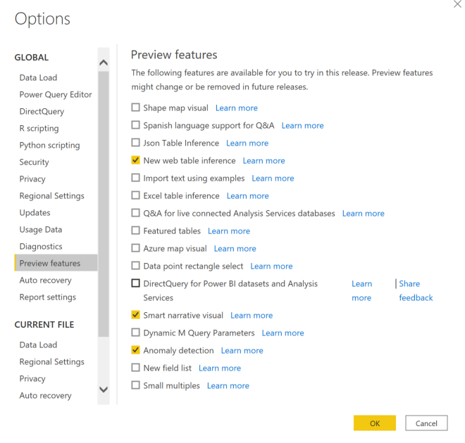
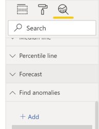
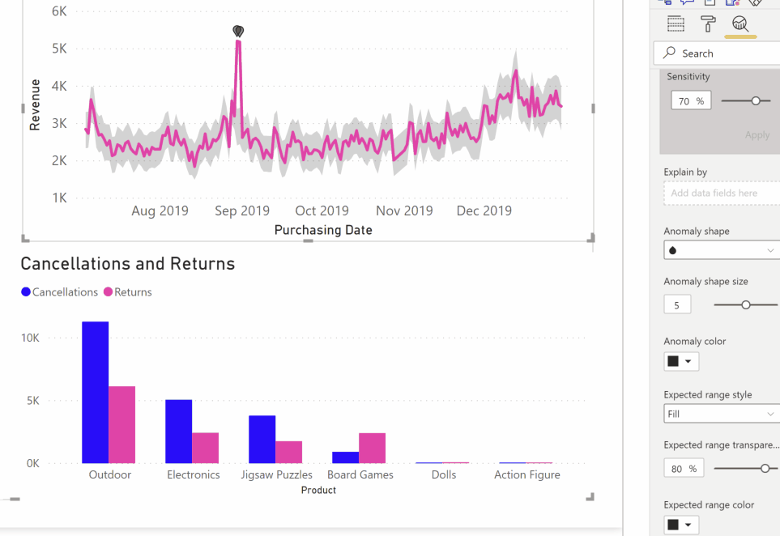
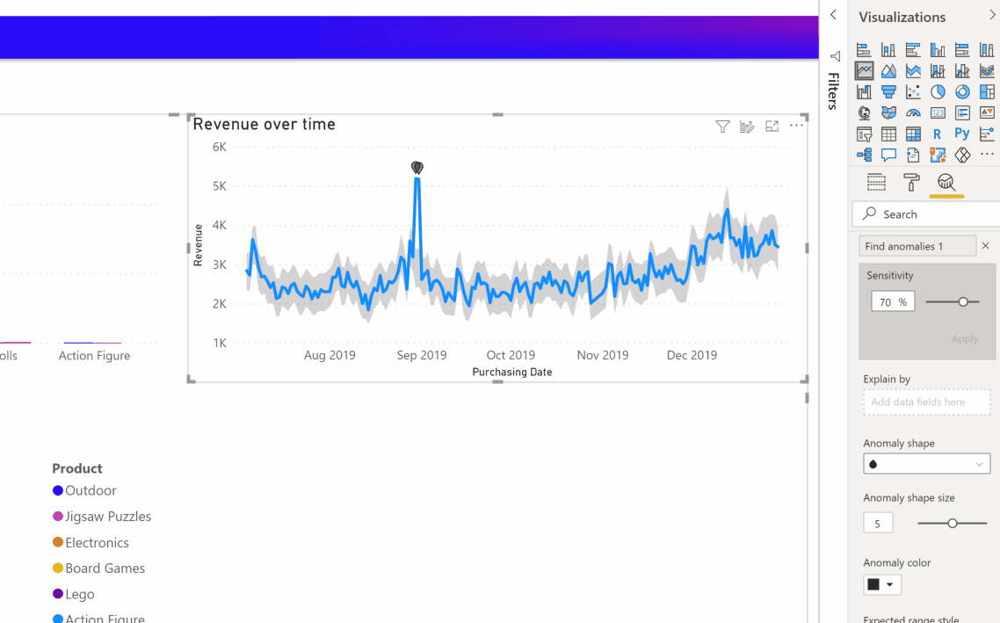

# Anomaly detection (preview)

[!INCLUDE[consumer-appliesto-nyyn](../includes/consumer-appliesto-nyyn.md)]    

 > [!NOTE]
   > This can be created and viewed in both Power BI Desktop and the Power BI service. The steps and illustrations in this article are from Power BI Desktop.
   > 
   > 

Anomaly detection helps you enhance your line charts by automatically detecting anomalies in your time series data. It also provides explanations for the anomalies to help with root cause analysis.  With just a couple of clicks you can easily find insights without slicing and dicing the data.

 > [!NOTE]
   > Since this feature is in preview, you will first need to turn on the feature switch by going to File > Options and Settings > Options > Preview feature and make sure Anomaly detection is turned on:
   > 
   > 

 
##Get started:
This tutorial uses online sales data for various products. You can find the pbix used  here: online sales.pbix

You can enable Anomaly detection by selecting the chart and adding "Find Anomalies" option in the analytics pane. 

 

 For example, by adding the anomaly detection capability on this chart showing Revenue over time, the chart gets automatically enriched with anomalies, and expected range of values. When a value goes outside this expected boundary, it is marked as an anomaly.

 
 
###Format anomalies:

This experience  is highly customizable. You can format the anomaly's shape, size, color and also the color, style, transparency of expected range. You can also configure the parameter of the algorithm.  If you increase the sensitivity, the algorithm would be very sensitive to changes in your data such that even if  there is a slight deviation then it is marked as an anomaly. If you decrease the sensitivity, the algorithm would be more selective on what is considered an anomaly.

 
 
 ##Explanations:
In addition to detecting anomalies, you can also automatically explain the anomalies that are found in the data. When you select the anomaly, Power BI runs an analysis across fields in your data model to figure out possible explanations. It gives you a natural language explanation of the anomaly, and factors associated with that anomaly sorted by its explanatory strength. Here I can see that on Aug 30, Revenue was $5187 which is above the expected range of $2447 - $3423. The cards in this pane can be opened to see more details of the explanation.

 
 ###Configure explanations:
You can also control the fields that are used for analysis. For example, by dragging seller, city into the Explain by field well Power BI just restricts the analysis to just those fields. In this case,  the anomaly on Aug 31 seems to be associated with particular seller and cities. Here, seller "Fabrikam" has a strength of 99%.  “Strength” is calculated as the ratio of the deviation from expected value when filtered by the dimension to the deviation in total value.  Concretely, it is the ratio of deviation (actual minus expected value) between the component time series (e.g., Revenue for Seller = Fabrikam) and the aggregate time series (e.g., overall Revenue) for the anomaly point. Opening this card shows the visual with a spike in the revenue for this seller on Aug 31. You can use the "Add to report" option to add this visual to the page.

#Limitations
